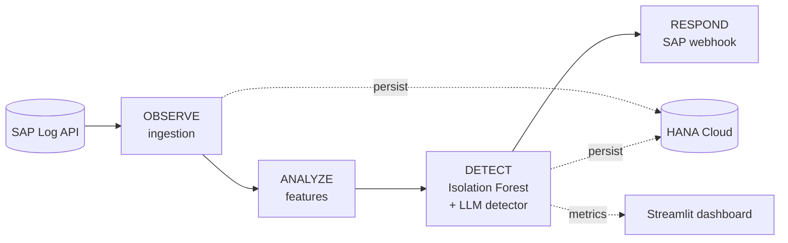

# SAP AI Security — Threat Detector

**TEC × SAP Hackathon — Live Security Operations Center Defense**

Real-time threat detection for SAP infrastructure using unsupervised
machine learning on SAP security logs. The system observes the live
SAP log stream, scores per-IP behavior with an Isolation Forest, and
fires HMAC-signed incident webhooks to the SAP Alerting endpoint —
all running on SAP BTP Cloud Foundry with SAP HANA Cloud as the data
plane.

The full technical architecture is in [`docs/ARCHITECTURE.md`](docs/ARCHITECTURE.md).
A pipeline diagram source for diagrams.net is at
[`docs/architecture.drawio`](docs/architecture.drawio).

---

## Mission

**OBSERVE → ANALYZE → DETECT → RESPOND**

1. **Ingest** SAP security logs over the paginated SAP log API.
2. **Analyze** per-IP behavior using a 17-feature matrix.
3. **Detect** anomalies with an Isolation Forest plus an LLM-stream
   detector for the conversational AI traffic.
4. **Respond** automatically via the SAP Alerting Webhook.

---

## Architecture



Deployed as a single Cloud Foundry application on SAP BTP. The
FastAPI web process hosts the asyncio pipeline as a background task
and exposes operational endpoints (`/health`, `/ready`, `/predict`,
`/metrics`, `/anomalies`, `/agent`). A daily Cloud Foundry task
retrains the model from the last 30 days of HANA history.

---

## Key dates

| Date | Milestone |
|---|---|
| 2026-04-13 | SAP Security Log API access |
| 2026-04-27 | SAP Alerting Webhook access |
| **2026-05-04** | **Production go-live on SAP BTP** |
| 2026-05-12 to 14 | First eliminatory phase |
| 2026-05-21 | Final phase |

---

## Getting started

```bash
git clone https://github.com/danieldiazde/sap-threat-detector.git
cd sap-threat-detector

python -m venv .venv
source .venv/bin/activate

make install            # pip install -r requirements-dev.txt
cp .env.example .env    # fill in values

make test               # unit + integration
make dashboard          # Streamlit SOC dashboard (local only)
make run                # run the pipeline locally
```

Mock mode is automatic — when `SAP_API_URL`, `SAP_WEBHOOK_URL`, and
`HANA_HOST` are unset, the system reads from `data/samples/`, logs
alert payloads locally, and uses in-memory repositories.

---

## Build, test, deploy

```bash
make api                # uvicorn src.api.main:app --reload
make lint               # ruff check
make format             # ruff format
make test-unit          # pytest tests/unit
make test-model         # pytest tests/model
make test-integration   # pytest tests/integration
make train              # train from data/samples
make deploy             # cf push -f infra/manifest.yml
```

CI runs lint + the full test matrix on every PR. Deploys are
GitHub-Actions-driven; secrets are injected via `cf set-env` and never
committed.

---

## Evaluation criteria

| Criterion | Weight |
|---|---|
| Operational Efficiency & Real-Time Response (MTTD) | 40% |
| SAP Ecosystem Integration & Tooling | 25% |
| Architecture & MLOps Maturity | 20% |
| Business Impact & Strategic Analysis | 15% |

The system reports **dual MTTD** on every detection:

- `pipeline_mttd_ms` — internal latency from ingestion to detection.
- `e2e_mttd_ms` — real-world latency from log timestamp to detection.

---

## Repository layout

```
src/
  api/          FastAPI app + Pydantic schemas
  agent/        Conversational SOC agent (read-only HANA tools)
  alerting/     Webhook, deduplication, incident reports
  common/       Settings, logging, metrics, CF proxy, time utils
  dashboard/    Streamlit SOC dashboard (local only)
  ingestion/    SAP log fetcher + parser
  llm/          LLM-stream anomaly detector
  model/        Features, train, predict, versioning, evaluate
  storage/      HANA pool, repositories, migrations
  pipeline.py   Orchestrator
scripts/        CLI tools
tests/          Unit, integration, model tests
infra/          Cloud Foundry manifest
docs/           Architecture, model journal, ADRs, agent spec
```

---

## Security

- No secrets in source. `.env` is gitignored; secrets are injected at
  deploy time by GitHub Actions.
- HANA connections are TLS-only and routed through the SAP BTP
  Connectivity Service Proxy.
- Webhook payloads are HMAC-signed; the SAP Alerting endpoint is
  bearer-authenticated.
- The conversational SOC agent's database role is read-only and
  scoped to the three SOC tables.
