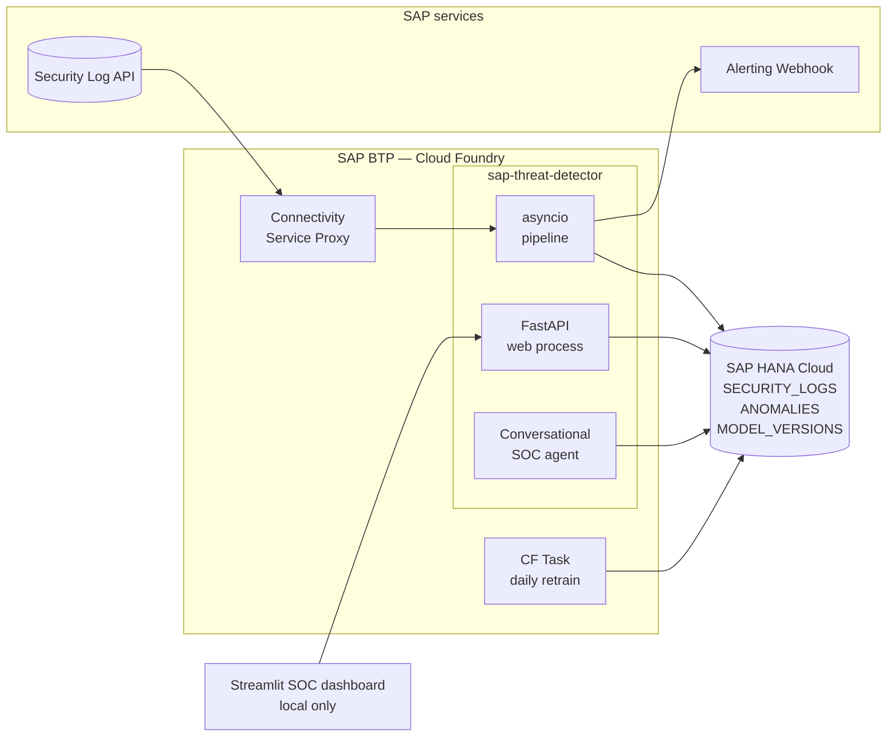
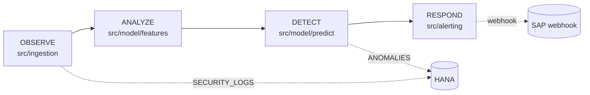
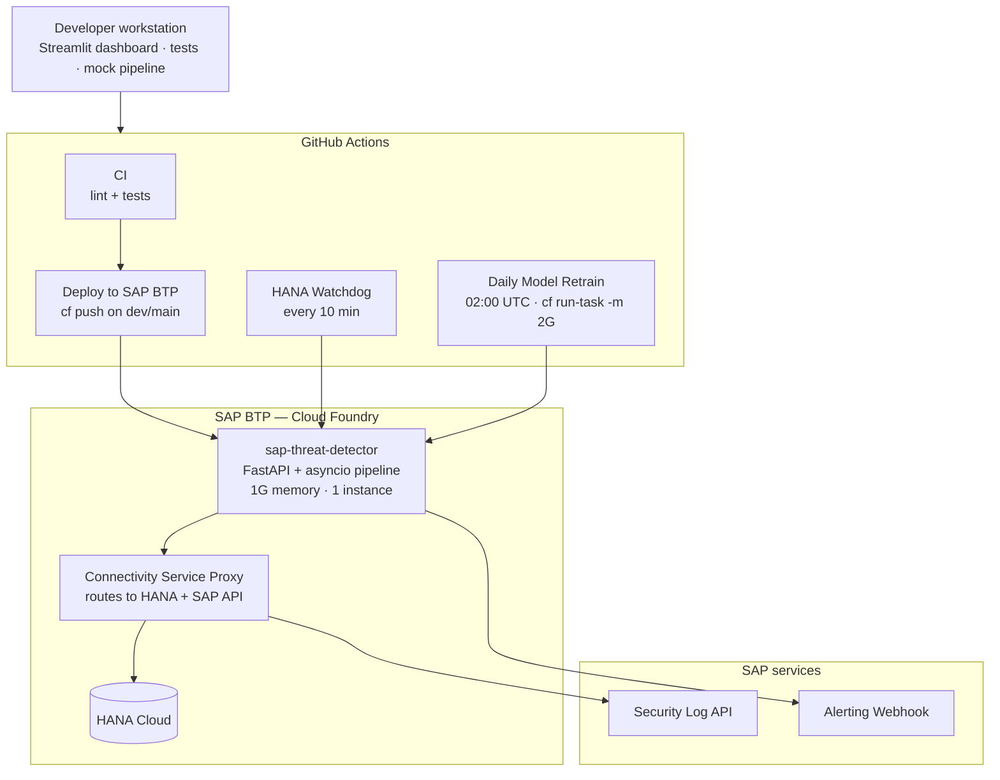

# Architecture

SAP AI Security — Threat Detector is a real-time Security Operations Center
that performs unsupervised anomaly detection on SAP security logs. It runs
as a single Cloud Foundry application on SAP BTP, combining a FastAPI web
process with an asyncio background pipeline, persisted to SAP HANA Cloud,
with alerts dispatched to the SAP Alerting Webhook.

## Goals

- Detect anomalous activity in the SAP security log stream with low Mean
  Time to Detect (MTTD), measured both as internal pipeline latency and
  end-to-end real-world latency.
- Operate continuously and unattended on SAP BTP Cloud Foundry, including
  retrain, watchdog, and self-healing data paths.
- Persist every observation, feature row, and anomaly to SAP HANA Cloud
  for forensics, retraining, and dashboarding.
- Respond to high-confidence anomalies by posting structured incident
  payloads to the SAP Alerting Webhook with HMAC signing, deduplication,
  and retry.

## Non-goals

- Supervised classification of attack types — the model is unsupervised
  by design, since labeled SAP-internal attack data is not available.
- Long-horizon trend forecasting — the system is tuned for short-window
  detection (minutes), not capacity planning.
- Cross-tenant aggregation — each deployment scopes a single SAP space.

## System overview



The FastAPI process serves the operational HTTP surface (`/health`,
`/ready`, `/predict`, `/metrics`, `/anomalies`, `/agent`) and hosts the
pipeline coroutine as an asyncio background task. The pipeline polls the
SAP API, scores incoming logs, persists results, and fires alerts. The
conversational SOC agent (`src/agent/`) shares the same FastAPI process
and exposes a curated, read-only HANA tool surface.

## Detection pipeline



### OBSERVE — `src/ingestion/`

- `sap_log_fetcher.py` — paginated async fetch from the SAP API driven by
  the API's own `/info` pagination spec. Mock mode reads CSV samples
  from `data/samples/`.
- `log_parser.py` — column normalization, type coercion, and field
  aliasing via `_COLUMN_ALIASES`. The parser deliberately discards
  Elasticsearch envelope fields (`_id`, `_index`, `_score`, etc.) and
  LLM-internal payloads (`llm_prompt`, `llm_temperature`, etc.).
- A `UNIQUE` index on the source `_id` prevents duplicate ingestion when
  pagination overlaps.

### ANALYZE — `src/model/features.py`

For each `source_ip` in a configurable context window, the feature
matrix collects 17 numeric features:

`total_requests`, `error_rate`, `post_ratio`, `unique_paths`,
`status_4xx_count`, `status_5xx_count`, `denied_ratio`,
`suspicious_path_ratio`, `is_destructive_ratio`, `sql_injection_hits`,
`brute_force_score`, `port_diversity`, `app_diversity`,
`region_diversity`, `interarrival_std`, `interarrival_mean`,
`request_rate_zscore`.

Schema evolution note: rows ingested before commit `5b5d777`
(2026-04-21) have NULLs in 16 of 22 columns. Null handling is
intentionally explicit; see `docs/MODEL_JOURNAL.md` for the current
strategy.

### DETECT — `src/model/predict.py`

- Loads the active model from `ModelRegistry` (joblib-backed,
  version-tagged).
- Primary detector: `sklearn.ensemble.IsolationForest`
  (`n_estimators=200`, `contamination=0.05`).
- Secondary detector: LLM ensemble (rules + cohort z-scoring) for
  LLM-stream traffic, wired into the live loop via `src/llm/`.
- Scores feature vectors with `decision_function` and assigns threat
  levels (`high` / `medium` / `low`) from configurable thresholds.
- Stamps **dual MTTD** on every row:
  - `pipeline_mttd_ms` = `detected_at` − `ingested_at` (internal latency)
  - `e2e_mttd_ms` = `detected_at` − earliest `log.datetime` (real-world
    latency)

### RESPOND — `src/alerting/`

- `sap_webhook.py` — `POST /alert` with bearer auth and a structured
  `WHAT / WHEN / WHY` payload, retried with exponential backoff.
- `deduplication.py` — TTL-based suppression to prevent alert storms
  when an anomalous IP fires across consecutive windows.
- `incident_report.py` — Markdown forensic report assembled for every
  high-severity anomaly; the template lives at `docs/INCIDENT_REPORT.md`.

## Deployment topology



The Streamlit dashboard is local-only — it is not deployed to Cloud
Foundry. It reads from the deployed app's HTTP surface and from HANA
directly for ad-hoc forensics.

## Data plane — SAP HANA Cloud

Three tables back the system:

| Table | Purpose |
|---|---|
| `SECURITY_LOGS` | Raw normalized log rows, deduplicated by source `_id` |
| `ANOMALIES` | Scored anomalies with dual MTTD columns and feature snapshot |
| `MODEL_VERSIONS` | Registry of trained models — version, metrics, joblib pointer |

Connection pooling lives in `src/storage/pool.py` (size 4, `encrypt=True`
on port 443). All HANA traffic is tunneled through the BTP Connectivity
Service Proxy via `proxyHTTPtunnel=True`, which is required when the app
runs in an isolated CF security group.

Migrations are append-only and idempotent. The original 6-column
`SECURITY_LOGS` was expanded to 22 columns in commit `5b5d777`; the
migration playbook in `scripts/migrate_add_columns.py` wraps each
`ALTER TABLE ... ADD` in a try/except that catches HANA's
"already exists" error, so the script is safe to re-run.

## Configuration

All runtime configuration flows through `src/common/config.py` →
`Settings` dataclass (frozen, loaded once from env at startup). The
`Settings` instance is the single source of truth — no `os.getenv()` is
called outside `config.py`. Env vars are documented in `.env.example`.

## Mock mode

Mock mode is **derived**, never explicitly configured. Each external
dependency flips out of mock mode the moment its URL or host env var is
set, which keeps developer laptops decoupled from SAP credentials:

| Dependency | Env var | Mock behavior |
|---|---|---|
| SAP API | `SAP_API_URL` | Reads from `data/samples/*.csv` |
| SAP Webhook | `SAP_WEBHOOK_URL` | Logs alert payload locally |
| HANA Cloud | `HANA_HOST` | In-memory repositories |

## Model lifecycle

- Models are saved with `joblib` (never `pickle`) by
  `src/model/versioning.py`. The registry writes versioned bundles to
  `models/`.
- Training is **windowed** — the trainer queries a recent N-day slice
  from HANA in production (default 30 days), or reads
  `data/samples/sample_logs.csv` in dev. Windowed training was
  introduced to remove the train/inference distributional mismatch that
  came from training on the full historical dump.
- Retraining is automated via the `Daily Model Retrain` workflow at
  02:00 UTC, which invokes `cf run-task` with explicit memory budget
  (2G) to fit the model fit plus 30 days of HANA features.

## Observability

- Structured JSON logging via `python-json-logger`. `src/` contains no
  `print()` calls; CLI scripts in `scripts/` are the only allowed
  `print()` site.
- `src/common/metrics.py` exposes in-memory counters, MTTD percentiles
  (p50/p90/p99), and per-stage latency.
- `GET /metrics` returns all KPIs as JSON.
- `GET /ready` checks HANA reachability, model presence, and pipeline
  health. Used by Cloud Foundry's HTTP health check.
- A scheduled `HANA Watchdog` GitHub Action probes HANA SQL directly
  every 10 minutes and ignores transient connectivity-router blips, so
  it surfaces real HANA-side failures only.

## Conversational SOC agent

A read-only conversational analyst (`src/agent/`,
`src/dashboard/pages/5_Agent.py`) sits on top of the same HANA tables.
It exposes a curated tool surface — schema introspection, sample
queries, server-side aggregation with a 20-row safety cap — designed to
prevent context-window blowups and arbitrary code execution. The full
design contract is in `docs/CONVERSATIONAL_AGENT.md`.

## Security considerations

- No secrets in source. `.env` is gitignored; only `.env.example` is
  committed. Production secrets are injected by GitHub Actions via
  `cf set-env` during deploy.
- HANA connections are TLS-only (`encrypt=True`, port 443) and routed
  through the Connectivity Service Proxy.
- Webhook payloads are HMAC-signed; the Alerting endpoint is bearer
  authenticated.
- The conversational agent's database role is read-only and scoped to
  the three SOC tables. The `run_custom_query` tool structurally
  prevents the "fetch and count" anti-pattern by capping returned rows.

## Repository layout

```
src/
  api/          FastAPI app + Pydantic schemas
  agent/        Conversational SOC agent (read-only HANA tools)
  alerting/     Webhook, deduplication, incident reports
  common/       Settings dataclass, logging, metrics, CF proxy, time utils
  dashboard/    Streamlit SOC dashboard (local-only)
  ingestion/    SAP log fetcher + parser
  llm/          LLM-stream anomaly detector
  model/        Features, train, predict, versioning, evaluate
  storage/      HANA pool, repositories, migrations, schema
  pipeline.py   Orchestrator
scripts/        CLI tools (mock data, train, audits, migrations)
tests/          Unit, integration, model tests
infra/          Cloud Foundry deployment manifest
docs/           Architecture, model journal, ADRs, conversational agent spec
```

## Key dates

| Date | Milestone |
|---|---|
| 2026-04-13 | SAP Security Log API access provisioned |
| 2026-04-27 | SAP Alerting Webhook provisioned |
| 2026-05-04 | Production deploy on SAP BTP Cloud Foundry |
| 2026-05-12 | First eliminatory phase — judges evaluate live system |
| 2026-05-21 | Final phase |
